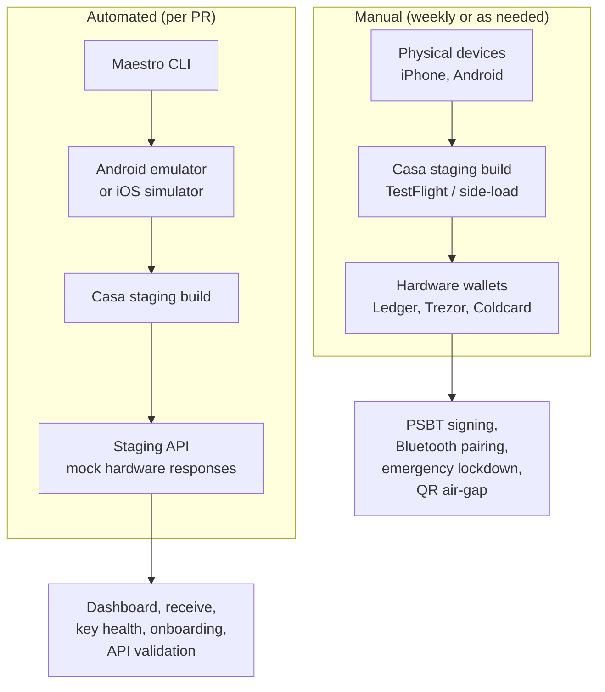

# Maestro mobile testing strategy

A conceptual Maestro flow for the Casa mobile wallet, demonstrating
how a core user journey would be structured for E2E automation.

## Running
```bash
# Install
curl -Ls "https://get.maestro.mobile.dev" | bash

# Run
maestro test flows/vault.yaml
```

Requires an Android emulator or iOS simulator with the Casa staging
build installed and a test account with a configured vault.

## Test architecture


## Simulation vs. physical devices

Flows run on device simulators, with Maestro driving the
app UI. This would not cover working with physical devices like hardware wallets.

## Mocking hardware wallets

For automated CI runs, hardware responses would be mocked. Options:

1. **API-layer mocks:** Staging backend returns pre-signed
   responses when the app expects a hardware signature. Maestro would be able to be able to move through transaction flows.
   The staging API would return pre-signed responses in place of real wallet signatures. 
   Mocks live server-side. from Maestro's perspective, the YAML steps should work with real or mocked responses.

   Custom JS via `runScript` would be useful after a mocked signing
   flow to verify the result (check signatures and response status).

2. **Feature flags:** LaunchDarkly (already in Casa's stack) could enable
   a test mode that bypasses the hardware signing step within the
   app itself.

## What stays manual

- **Hardware wallet pairing and signing** with real Ledger, Trezor,
  and Coldcard devices. Separate cadence (weekly or per-release)
  at on dedicated test devices.
- **QR-based air-gapped signing** (Coldcard). Camera-to-QR handoff
  is fragile to automate and better verified by hand.
- **Emergency lockdown**. Given security implications, manual
  verification with a full signing attempt afterward is more
  trustworthy than automation alone.
  

 - Any automation for these would require careful investigation and creativity.